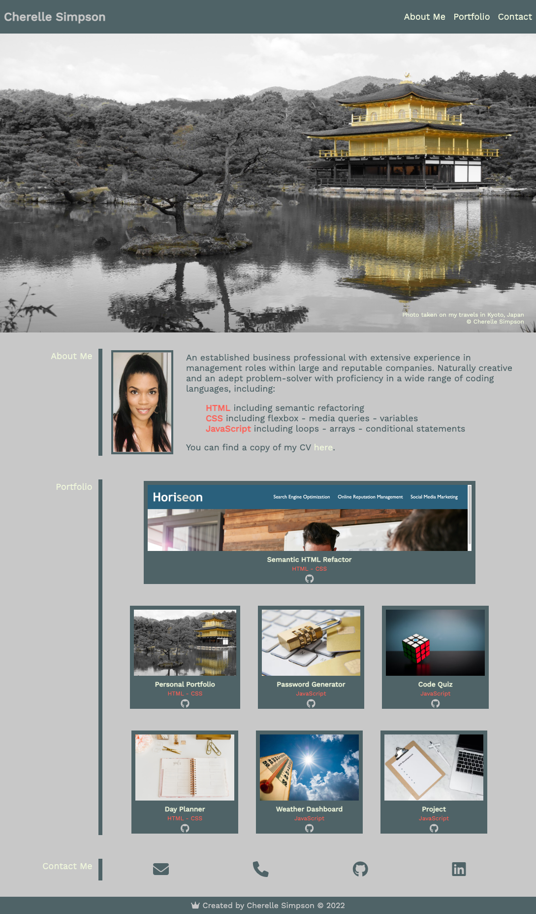
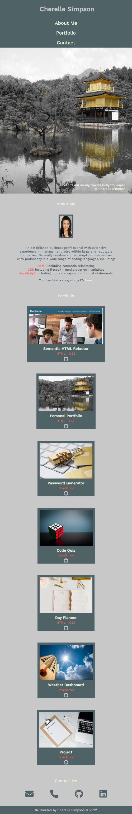

# portfolio

Personal portfolio of projects using my skills across a range of front end and back end coding languages and tools.

[Deployed GitHub URL](https://c-sim.github.io/portfolio/)

## Technologies

- HTML
- CSS
  - Media queries
  - Flexbox
  - Variables
- GitHub Pages
- FontAwesome
- Google Fonts
- Coolors

## Screenshots

Desktop Viewport

Mobile Viewport

 

## About Me

- 👋 Hi, I’m @C-Sim
- 👀 I’m interested in coding, travel and photography
- 🌱 I’m currently learning full stack web development
- 📫 Reach me [GitHub](https://github.com/C-Sim)
